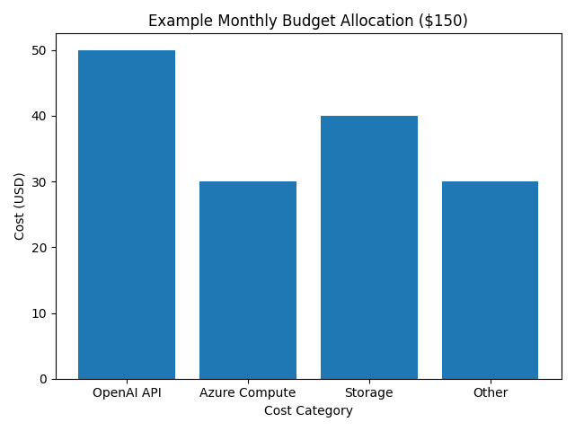

# Building with Budget Constraints: How Cost Limits Spark Better Engineering

## Constraints breed creativity

When we set out to build the AI Trainer, we gave ourselves another challenge: **spend no more than US$150/month** on infrastructure. This constraint forced us to scrutinise every architectural decision and look for opportunities to cut costs without cutting corners.

Too often, cloud budgets balloon because teams over‑provision or assume “serverless = cheap.” We wanted to prove that you can build a robust product on a shoestring by embracing frugality as a design principle.

## Mapping the budget

Where does US$150/month go when you’re running an AI‑powered web app? We split our budget into four buckets: language‑model API calls, compute, storage and everything else (authentication, monitoring and error reporting). The bar chart below visualises a rough allocation:

| Cost category | Description |
|---------------|-------------|
| **OpenAI API** | Our largest variable expense. Generating routines with GPT models could have eaten the entire budget, so we cached responses, reused templates and limited prompt length. |
| **Compute** | Running Azure Functions under the consumption plan is free up to a threshold, but vCPU seconds add up when functions run for long durations. |
| **Storage** | Firebase’s generous free tier covered early user data. We quickly learned that Azure SQL serverless, despite an advertised cost of about US$5/month, can unexpectedly balloon into triple‑digit bills if the database stays online ([learn.microsoft.com](https://learn.microsoft.com/)). |
| **Other** | Includes Firebase Authentication, monitoring tools and a small allocation for experiment costs like PDF generation. |

## Lessons learned

1. **Cache everything:** We stored generated routines in the browser’s localStorage and in Firestore so that repeated requests didn’t trigger new API calls. This halved our language‑model spend.

2. **Choose the right database:** Initially we experimented with Azure SQL serverless because it looked inexpensive. In reality, serverless databases accrue vCore charges whenever they’re online, even if they’re not being used. Developers have reported paying over US$125/month for a database they thought would cost US$5 ([learn.microsoft.com](https://learn.microsoft.com/)). Switching to Firebase/Firestore for the MVP saved us from unexpected spikes.

3. **Use free tiers wisely:** Services like Firebase offer generous free quotas. We made sure to purge unused data and stay within free limits. For future releases, we’re exploring PostgreSQL on Supabase, which has predictable fixed pricing.

4. **Monitor, then optimise:** We set up cost alerts in the Azure portal and Firebase console. Seeing real‑time usage empowered us to act quickly when costs crept up.

## Designing under a financial cap

The $150 cap shaped our engineering philosophy:

- We prioritised static hosting and client‑side rendering where possible to reduce server load.
- We experimented with small local language models (SLMs) for low‑resource devices. If a user’s phone can generate a routine offline, we don’t pay for an API call.
- We avoided long‑running background jobs, instead scheduling tasks on demand through user interaction.
- We invested time in writing clear documentation and deployment scripts so that environments could be torn down quickly when not needed.

## Conclusion

Budget constraints can feel limiting, but they’re also powerful catalysts. They compel you to make intentional decisions, question assumptions and build leaner systems. By embracing our $150 challenge, we discovered cost optimisations that will serve us well even when the budget grows.
