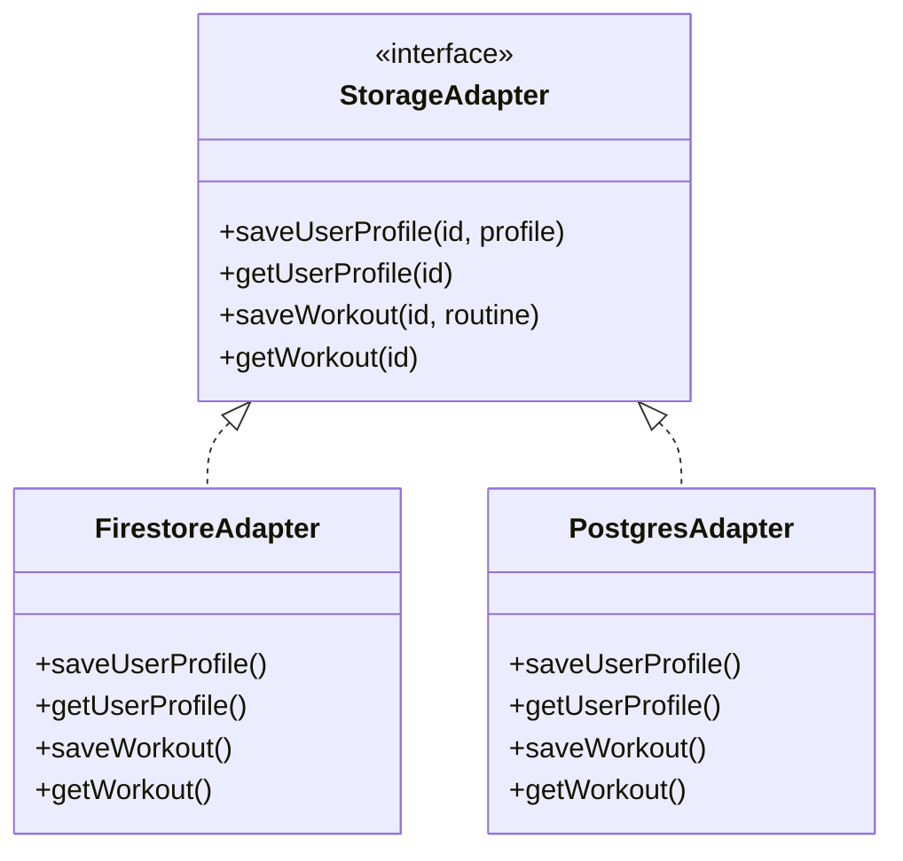

# Designing for Flexibility: Making Our App Storage‑Provider Agnostic

## Why flexibility matters

When you’re building a product in a rapidly evolving landscape—where customer needs, pricing models and technology stacks change quickly—you can’t afford to paint yourself into a corner. Early technical decisions have long‑term consequences. We wanted the freedom to switch databases, experiment with local models or even run parts of the app offline without rewriting our business logic.

## The problem: vendor lock‑in

Many frameworks encourage you to bake database calls directly into your code. That’s fine until you realise your chosen provider no longer fits your needs: it’s too expensive, too slow or missing features. We recognised this risk when prototyping with Firebase and exploring PostgreSQL and Azure SQL. Rather than hard‑coding queries everywhere, we decided to abstract the storage layer completely.

## The adapter pattern

We defined a `StorageAdapter` interface that described the operations our application cared about—creating and retrieving user profiles, storing workout routines and caching prompts. Each concrete implementation handled its own persistence logic. Here’s a simplified view of the pattern:

At runtime we select which implementation to use via an environment variable or feature flag. This enables A/B testing (e.g., half of users on Firebase, half on Postgres) and smooth migrations.

## Feature flags and configuration

To toggle behaviours without redeploying code, we implemented a simple feature flag service. Flags are stored in Firestore/Postgres and cached in memory. Examples include:

- `usePostgres`: If true, the app instantiates `PostgresAdapter`; otherwise it uses `FirestoreAdapter`.
- `enableSLM`: Toggles the use of small local language models instead of remote GPT calls.
- `showAnalyticsDashboard`: Controls whether users see an experimental progress‑tracking page.

This approach separates configuration from code. When we’re ready to enable a new storage provider or feature, we flip a switch.

## Challenges along the way

Designing for flexibility isn’t free. We encountered a few challenges:

- **Parities across providers:** Not every database supports the same data types or query patterns. For example, Firestore stores data as nested documents while Postgres uses tables. We wrote converters to normalise data structures so the rest of the app could remain agnostic.
- **Performance considerations:** Abstracting storage can introduce overhead. We mitigated this by keeping the interface coarse‑grained (fetch entire profiles instead of individual fields) and implementing caching at the adapter level.
- **Testing complexity:** Each adapter required its own set of integration tests. We used mocks to isolate unit tests and dedicated test databases to ensure consistent results.

## Benefits reaped

Despite the extra work, the benefits of an agnostic design have already paid off:

- **Seamless migration:** When we decided to experiment with PostgreSQL, we didn’t touch the business logic—only the adapter.
- **Resilience to pricing changes:** If a provider raises prices, we can switch without rewriting the app. Given that serverless pricing can be unpredictable ([learn.microsoft.com](https://learn.microsoft.com/)), this agility matters.
- **Experimentation:** The same pattern is being extended to caching, authentication and language models. Soon we hope to run small local models on devices and fall back to cloud models when necessary.

## Conclusion

Flexibility isn’t about indecision; it’s about giving yourself options. By abstracting our storage layer and using feature flags, we built an architecture that can evolve with our product and our users. The extra investment up front prevents costly rewrites later and empowers us to pivot quickly when opportunity—or budget pressure—demands it.