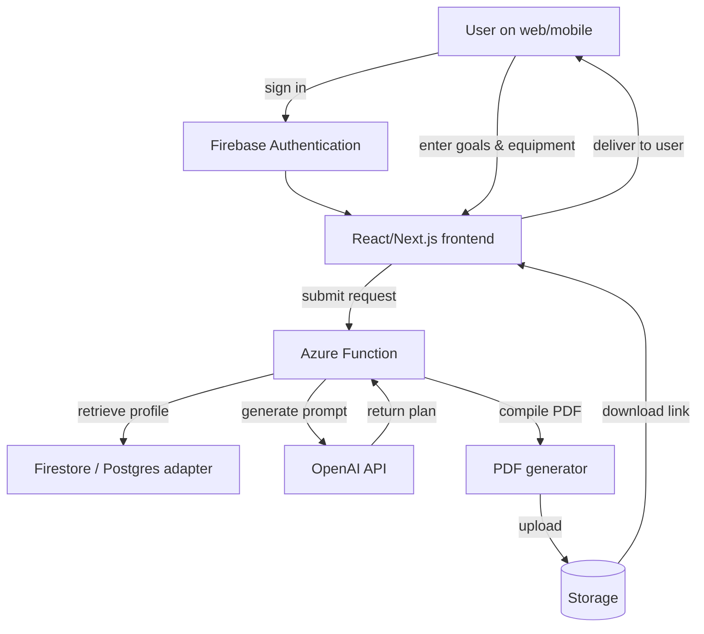
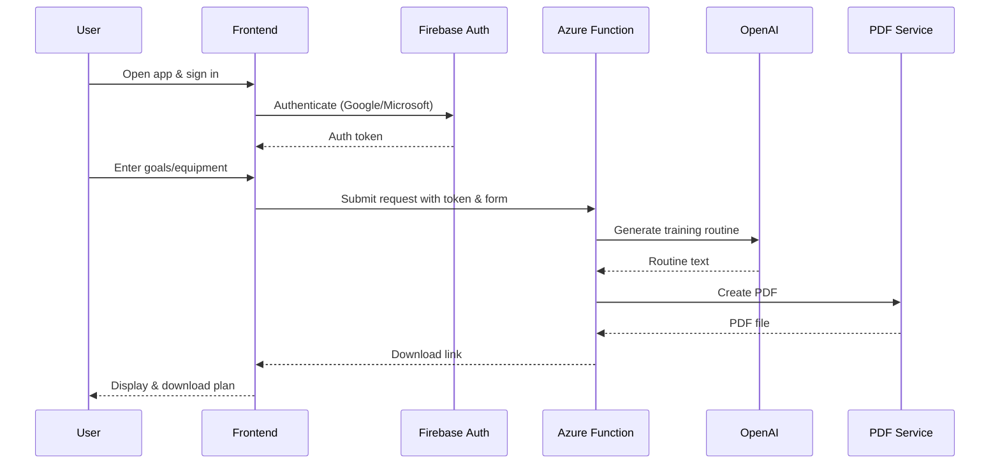

# How We Built an AI Trainer App in 2 Weeks
## The spark

We started this project with a simple problem: most fitness apps either force you into cookie‑cutter routines or require expensive personal training. What if anyone could get a personalised training plan in seconds? Armed with that question and a limited budget, we set out to build an AI‑powered trainer in just two weeks.

The goal for our minimum viable product (MVP) was deliberately small. We wanted users to:
sign up securely, describe their goals (strength, endurance or weight loss), physical limitations, and available equipment receive a tailored training routine generated by an AI language model, and download that routine as a beautifully formatted PDF.

Everything else—habit tracking, progress dashboards, social features—would come later. Keeping the scope tight let us focus on delivering value quickly without getting bogged down in features that didn’t matter yet.

## Architecture at a glance
Our stack combined familiar web technologies with serverless infrastructure and generative AI. The diagram below summarises the high‑level flow of a request:

### 1. Frontend
I built the UI in React/Next.js and hosted it on Firebase Hosting. Users could sign in with Google or Microsoft accounts via Firebase Authentication. Once authenticated, they filled out a short form describing their goals, limitations and available equipment.

### 2. Serverless back‑end
An Azure Function acted as the orchestration layer. It validated inputs, fetched user data from Firestore (our default storage), constructed a prompt and sent it to the OpenAI API. The response was then formatted into a PDF using a Node.js PDF library and uploaded to cloud storage.

### 3. Generative AI
We used a GPT‑3.5/4 model to generate personalised routines. The prompt included the user’s goals, experience level and equipment, along with rules to produce safe and varied workouts. When the API returned a routine, we structured it into an easy‑to‑read plan.

## User journey
From the user’s perspective, the experience was intentionally simple. The sequence diagram below illustrates the journey from first visit to downloading a training plan:

## Crafting the prompt
Designing the right prompt was as important as building the infrastructure. Early versions of our prompt simply listed the user’s goals and asked the model to “generate a workout routine.” The results were generic and sometimes unsafe. We iterated to add structure:

### 1. Context
We told the model it was a certified personal trainer and described the user’s goal (e.g., build strength) and level (beginner, intermediate, advanced).

### 2. Constraints
We specified available equipment (dumbbells, resistance bands, body‑weight only) and listed any injuries or limitations.

### 3. Output format
We asked for a table with columns for exercise, sets, reps and rest time. This allowed us to convert the response into a PDF easily.

These refinements produced personalised, safe routines that felt like they were written by a human trainer.

## Lessons from two weeks
- Focus beats features: Our tight timeframe forced us to prioritise the core value—delivering a customised plan—over bells and whistles. Users didn’t miss the features we postponed.

- Serverless scales… mostly: Azure Functions allowed us to move fast without managing servers, but cold‑starts and vCPU billing (see our upcoming post on costs) reminded us that serverless still requires careful tuning.

- Document your assumptions: We wrote down every constraint (time, cost, user needs). This prevented scope creep and made decision‑making easier when trade‑offs arose.

## Looking ahead
The MVP proved that generative AI can empower users with personalised training routines in minutes. Next steps include progress tracking, a dashboard to visualise workouts, and experimenting with small local models (SLMs) to reduce latency and cost. But even in its simplest form, the AI Trainer demonstrates the power of combining clear user stories, thoughtful architecture and the latest AI tools.